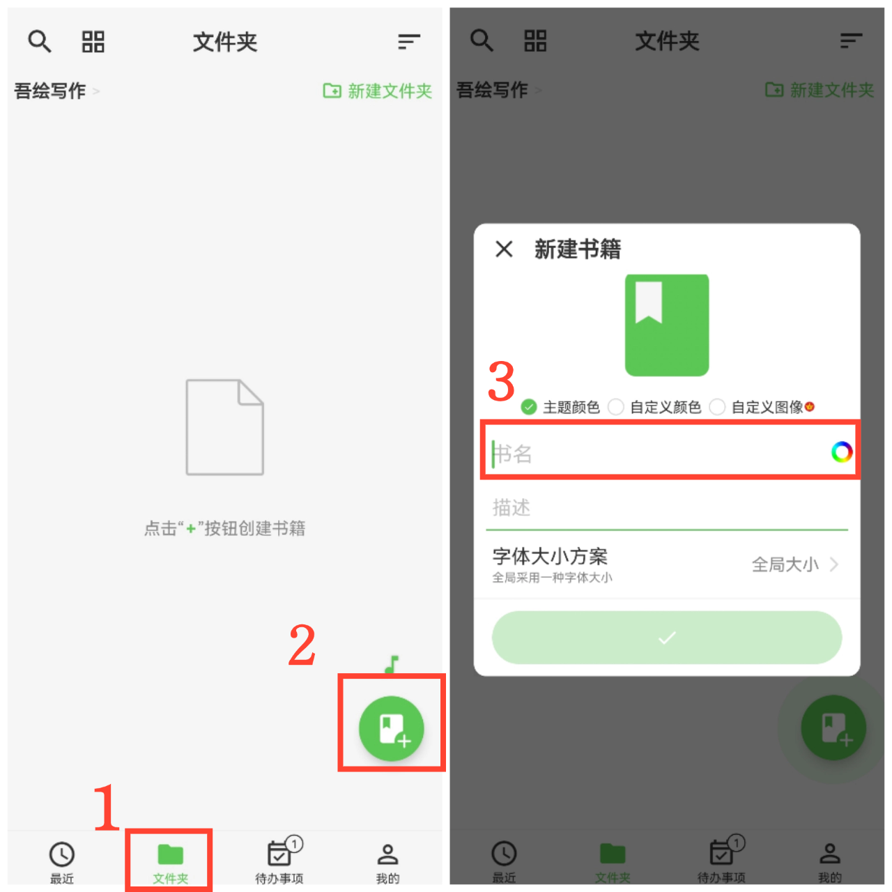

[用户手册](/yeswriter/manual/zh) > [文字笔记](/yeswriter/manual/zh/text_note) >

新建书籍
---

#### 操作步骤

1. 点击「文件夹」；
2. 点击“+”；
3. 输入书名。

#### 提示

1. 点击“自定义图像”，可从相册选择图片作为书籍封面。

2. 点击书名右侧的彩色圆形按钮，可设置书名颜色。

3. 点击“描述”，可为书籍添加简介。

4. 点击“字体大小方案”，可设置全局统一字体大小或自定义局部字体大小。
