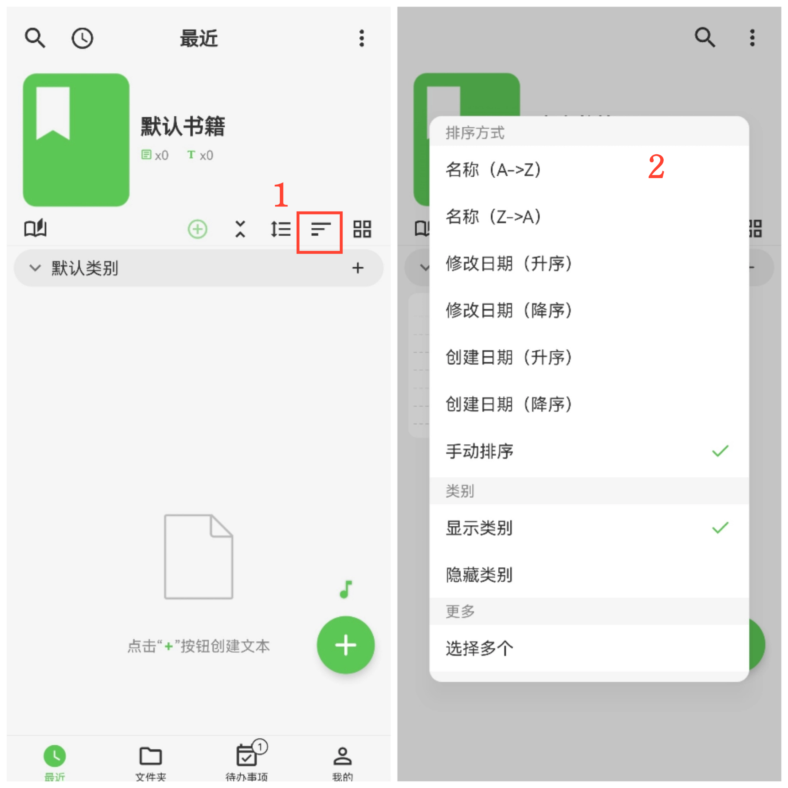
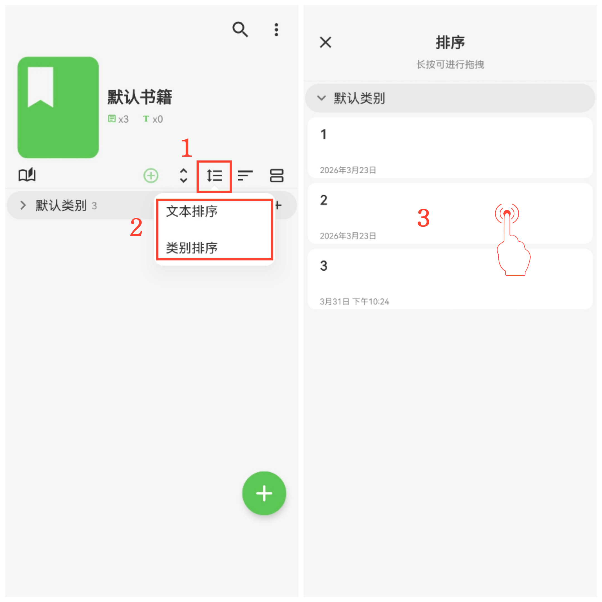

[用户手册](/yeswriter/manual/zh) > [文字笔记](/yeswriter/manual/zh/text_note) >

排序方式
---
#### 操作步骤

点击"排序方式"按钮，选择你需要的排序方式。

手动排序
---
#### 操作步骤

1.选择“手动排序”后，点击旁边的“手动排序”按钮；

2.选择文本排序或类别排序；

3.长按条目并上下拖拽，调整顺序。

