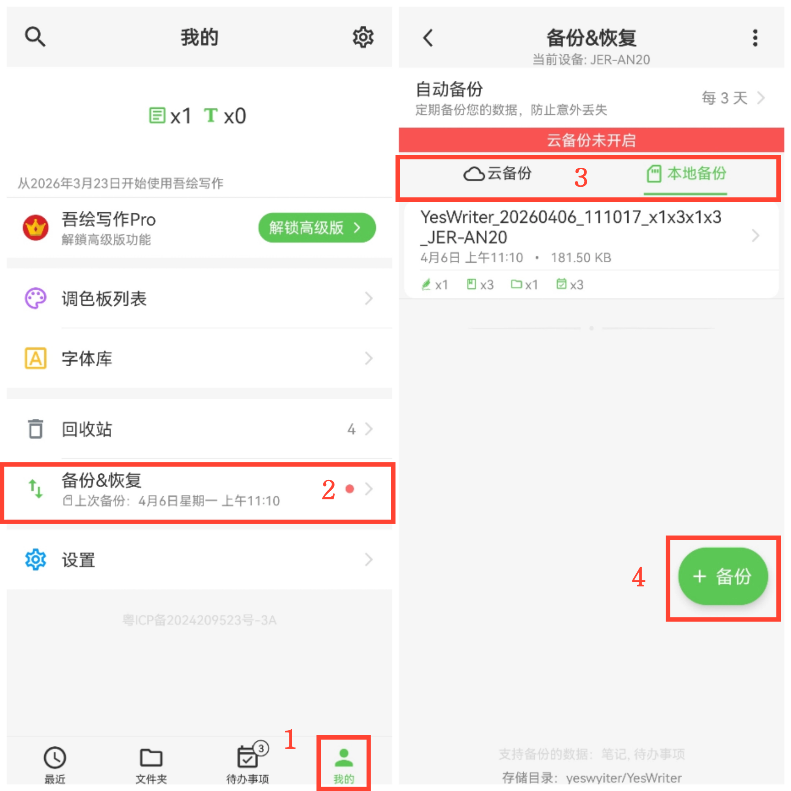

[用户手册](/yeswriter/manual/zh) > [数据备份和恢复](/yeswriter/manual/zh/data_backup_and_recovery) >

数据备份
---
#### 操作步骤

1.进入「我的」页面。

2.点击“备份&恢复”选项。

3.选择“本地备份”或“云备份”；

4.点击"+备份"，开始行备份。

#### 提示

首次备份：需先选择备份位置，再执行备份。