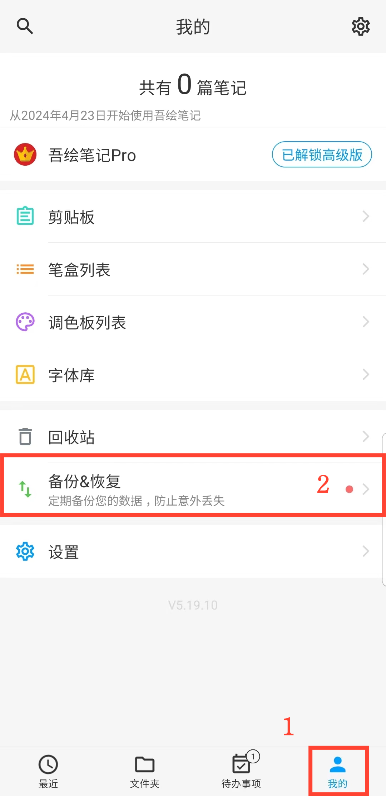

[用户手册](/drawnote/manual/zh) >

数据备份和恢复
---

使用数据备份和恢复功能，您可以轻松保护重要信息，避免意外丢失。

- [数据备份](data_backup.md)

- [自动备份](automatic_backup.md)

- [数据恢复](data_recovery.md)

- [管理备份数据](manage_backup_data.md)

- [使用坚果云轻松实现云端备份](jianguoyun_backup.md)

