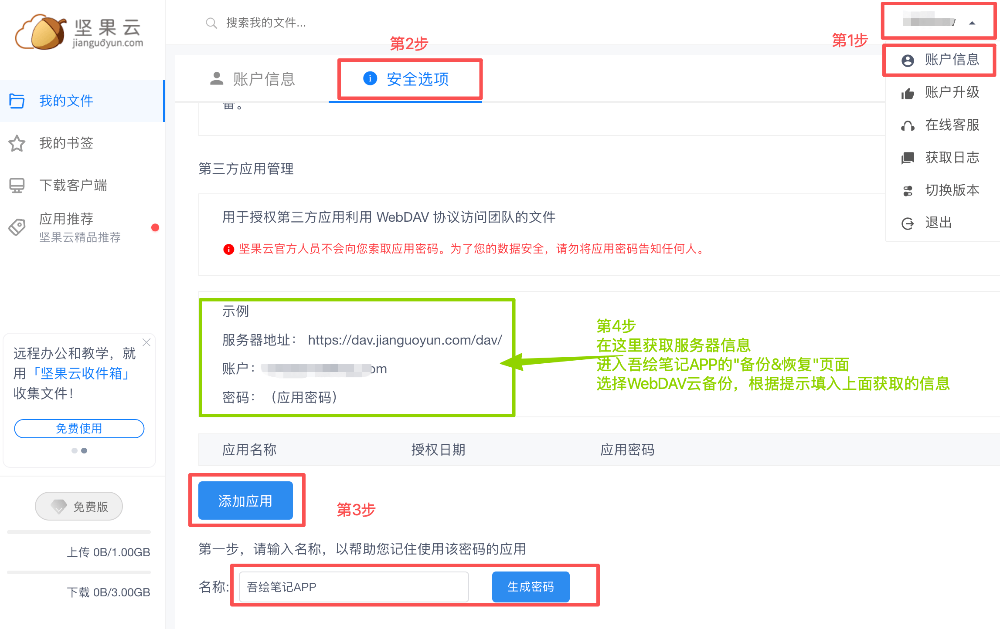

[用户手册](/drawnote/manual/zh) > [数据备份和恢复](/drawnote/manual/zh/data_backup_and_recovery) >

使用坚果云轻松实现云端备份
---
坚果云提供免费的云盘空间，你可以将数据备份到坚果云，实现安全、便捷的云端备份。这样即使更换设备或重装应用，也能快速恢复所有笔记。

###  操作步骤

 打开 [坚果云官网](https://www.jianguoyun.com/): [https://www.jianguoyun.com/](https://www.jianguoyun.com/), 使用网页版，注册并登录账号。
   
（如果是手机打开坚果云官网，则选择“**登录网页版**”，没有账号的话先“**创建账号**”，登录后切换底部标签至“**我的**”，点击“**请求桌面站点**”，进入桌面版网页。）

1. 登录后点击页面右上角的用户名，选择 **「账户信息」**。
2. 在顶部切换至 **「安全选项」** 标签页。
3. 滑动至底部的 **「第三方应用管理」** 区域，点击 **「添加应用」**，输入名称（例如 *吾绘笔记APP*），然后点击 **「生成密码」**。
4. 根据页面显示的信息，在 **「吾绘笔记APP → 备份&恢复 → 云备份」** 页面中，选择“WebDAV”填写相应内容：
    * **服务器地址**、**账户名** 按网页提示填写；
    * **密码** 使用刚刚生成的应用密码（可在坚果云的应用列表中查看）。

完成后，即可轻松将你的笔记同步备份到坚果云，让数据更安全、更安心。更换设备或重装应用时，只需登录坚果云既可快速恢复所有笔记。

