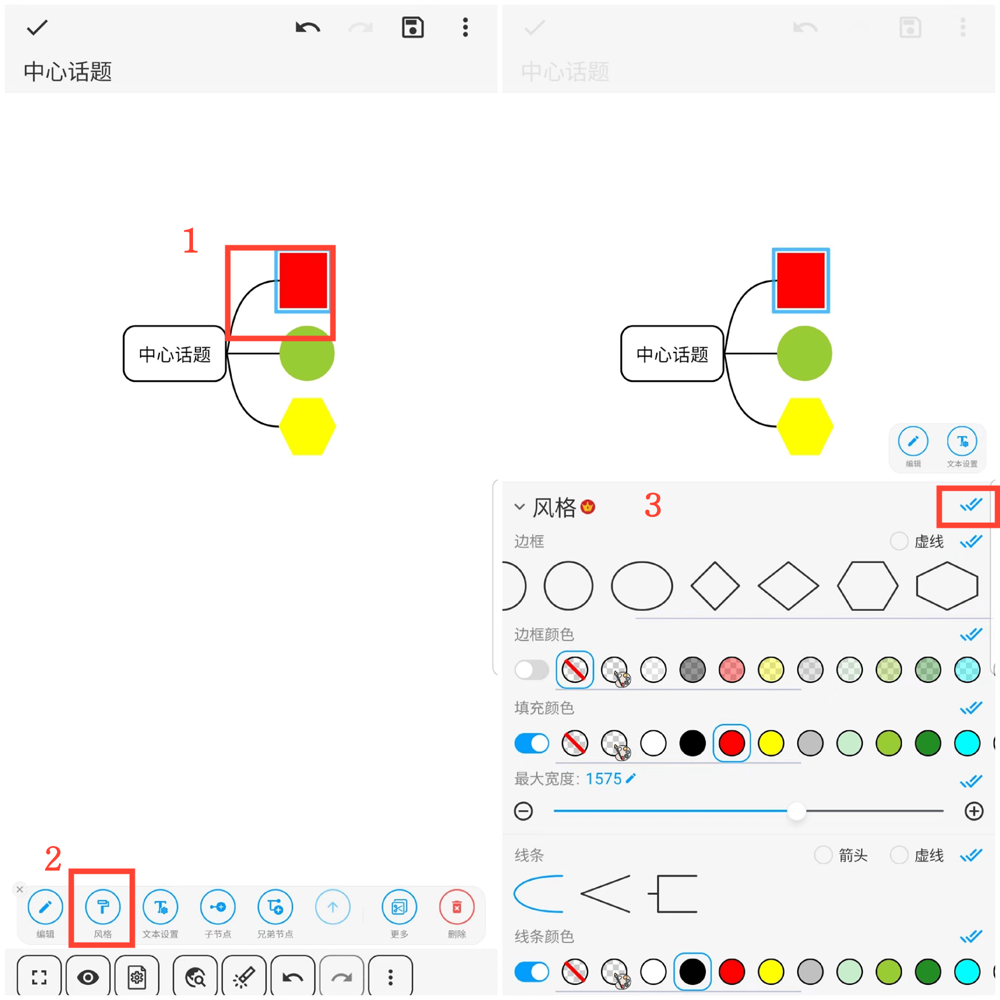

[用户手册](/drawnote/manual/zh) > [思维导图](/drawnote/manual/zh/mind_mapping) >

边框与线条风格
---
#### 操作步骤

1.点击要设置的节点框。

2.点击“风格”选项卡。

3.在弹出的窗口中，选择所需的风格选项，如边框形状、边框颜色、填充颜色、线条样式和线条颜色。

#### 提示

点击右侧的蓝色双对勾符号，可选择将风格应用于子节点、兄弟节点，或兄弟节点和子节点。
