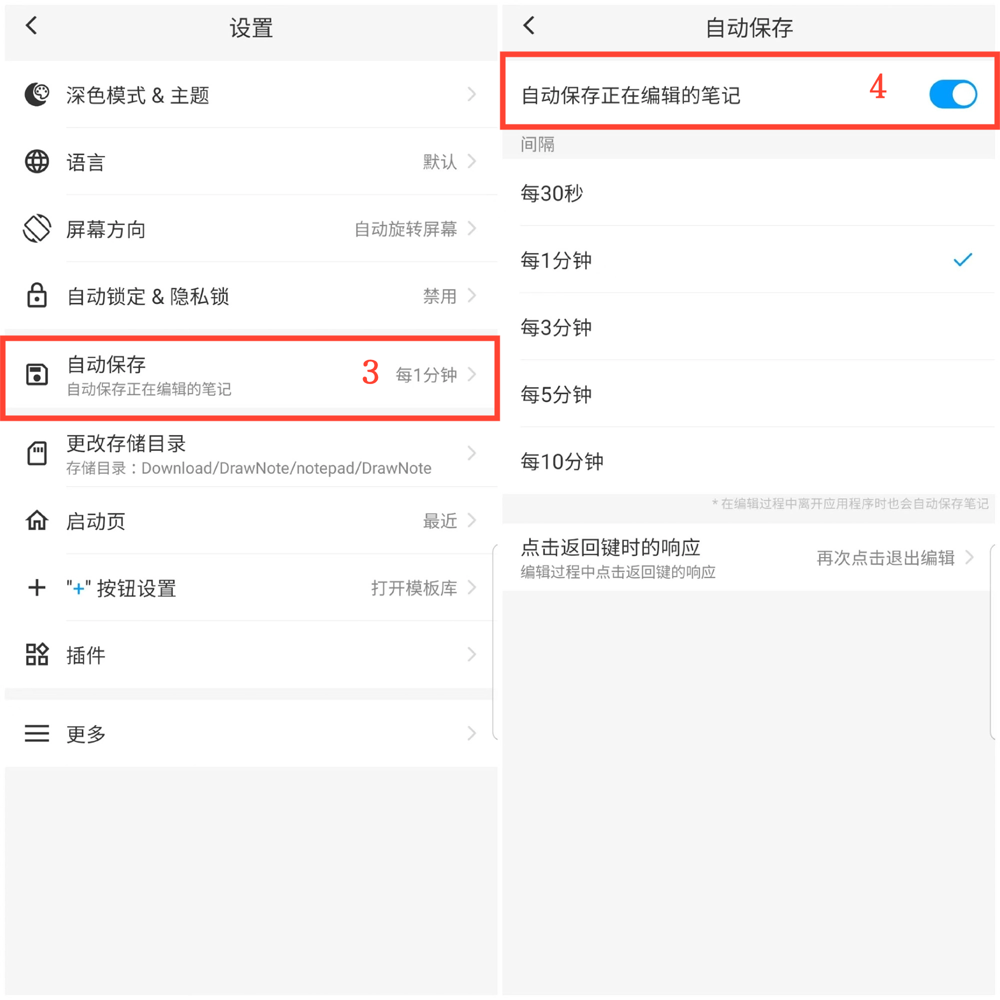
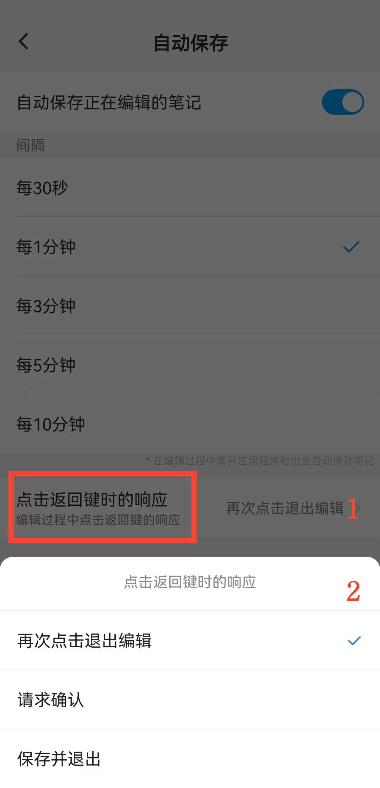

[用户手册](/drawnote/manual/zh) > [更多](/drawnote/manual/zh/more) >

自动保存
---
自动保存可防止数据意外丢失。

#### 操作步骤

1.点击主页的「我的」。

2.进入设置。

3.点击"自动保存"按钮。

4.打开按钮，选择自动保存时间。

#### 提示
- 编辑笔记时按系统返回键的提示可自定义。响应方式包括：再次点击退出编辑、请求确认和保存并退出。

  