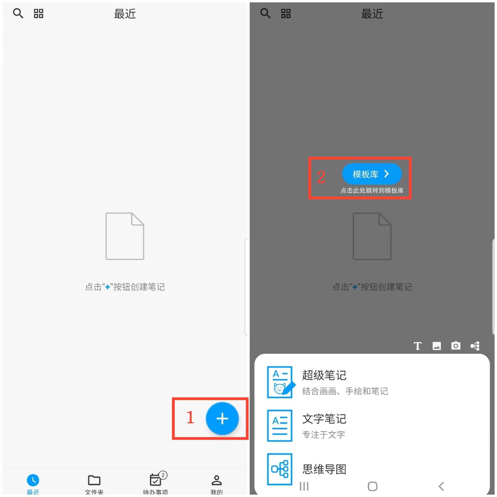
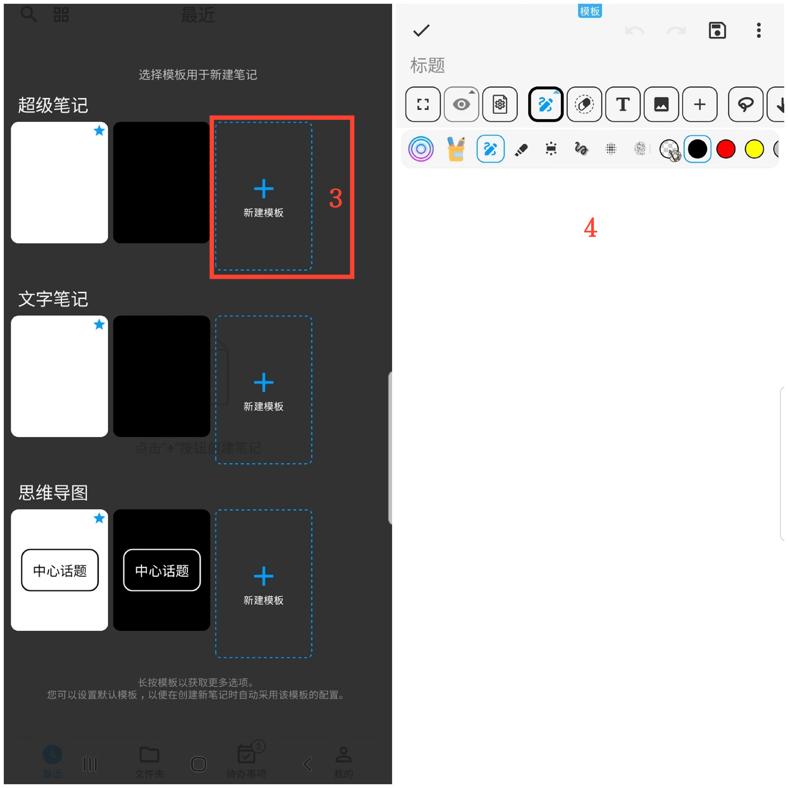
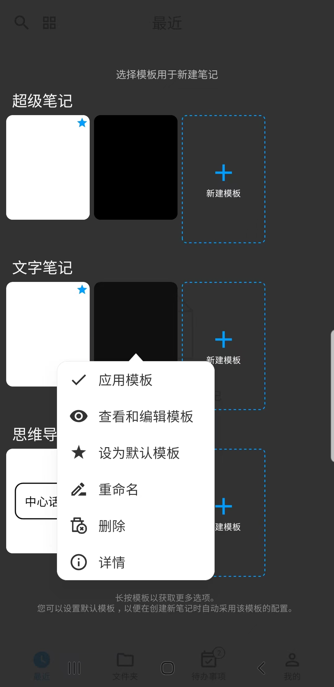

[用户手册](/drawnote/manual/zh) > [更多](/drawnote/manual/zh/more) >

创建模板
---
通过创建模板，您可以在新建笔记时自动应用该模板的配置，例如背景颜色、字体大小、字体颜色等常用设置。

### 操作步骤
1. 在应用首页，点击右下角的“+”图标。
2. 点击“模板库”。
3. 在所需的笔记类型后选择“新建模板”。
4. 进入模板编辑页面进行设置，包括背景颜色，字体大小，字体颜色等，配置完成后保存即可。

#### 提示
长按模板库可以获取更多选项,如查看和编辑模板、设为默认模板等。

