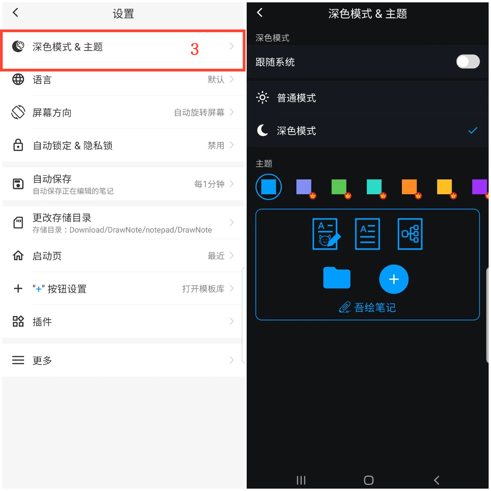

[用户手册](/drawnote/manual/zh) > [更多](/drawnote/manual/zh/more) >

深色模式和主题色切换
---
深色模式提供更加舒适的阅读体验，有助于减少眼睛疲劳并保护视力健康。这一功能使您能够轻松切换到更舒适的深色模式，并根据个人喜好选择主题颜色。

### 操作步骤
1. 在主屏幕上点击「我的」。
2. 进入设置。
3. 点击"深色模式&主题"。
4. 在此处，您可以切换深色模式并选择不同的主题颜色以定制个性化界面。

