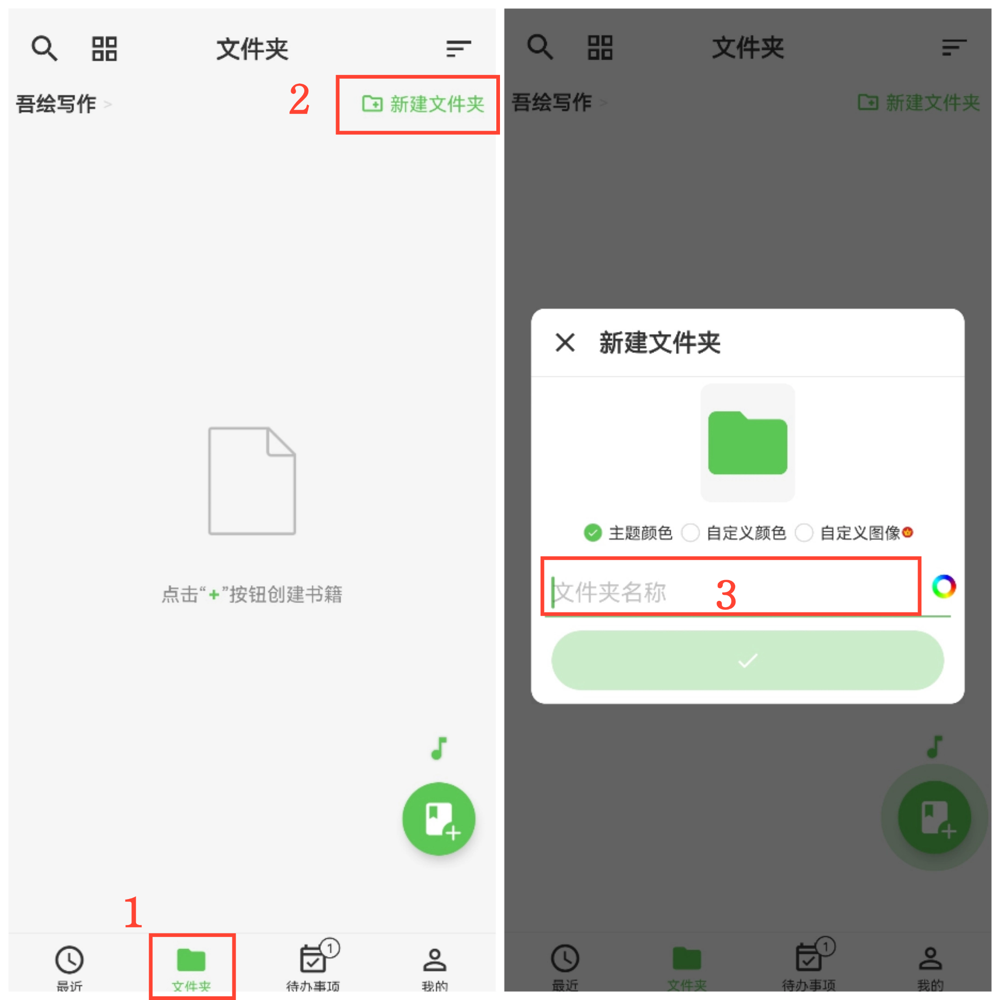

[用户手册](/yeswriter/manual/zh) > [文字笔记](/yeswriter/manual/zh/text_note) >

新建文件夹
---
#### 操作步骤

1. 点击「文件夹」；
2. 点击“新建文件夹”；
3. 输入文件夹名称。

#### 提示

1. 点击“自定义图像”，可从相册选择图片作为文件夹封面。

2. 点击“文件夹名称”右侧的彩色圆形按钮，可设置名称颜色。