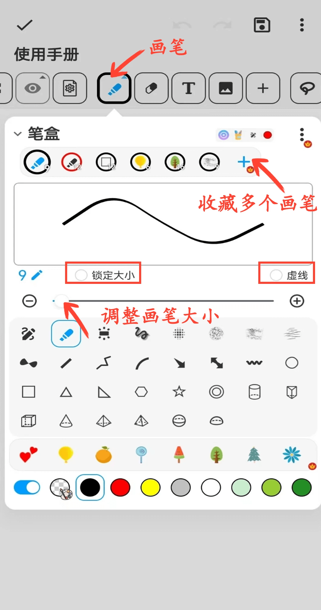
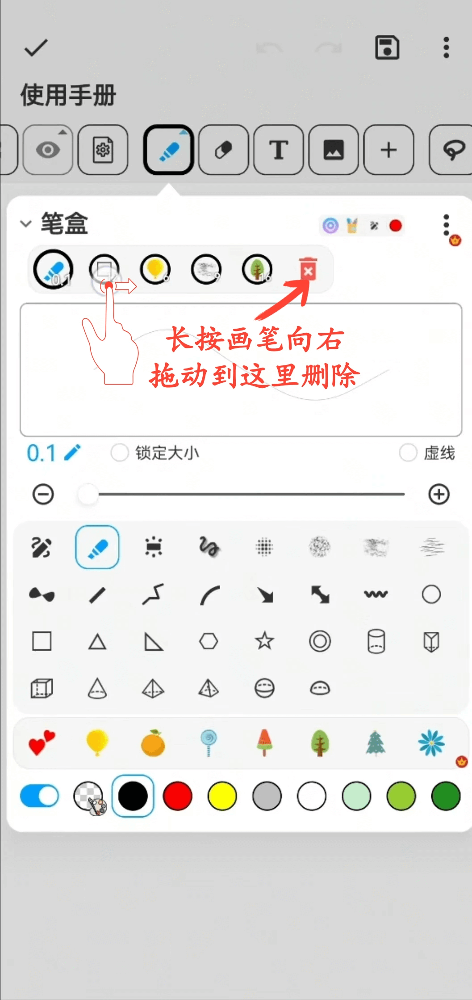
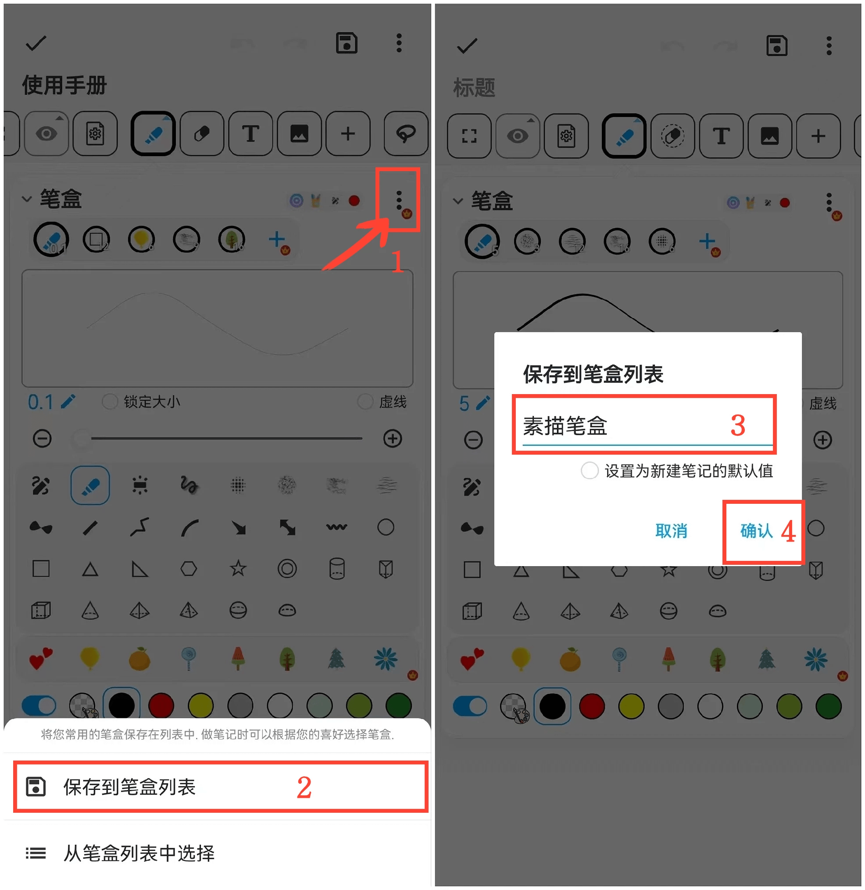
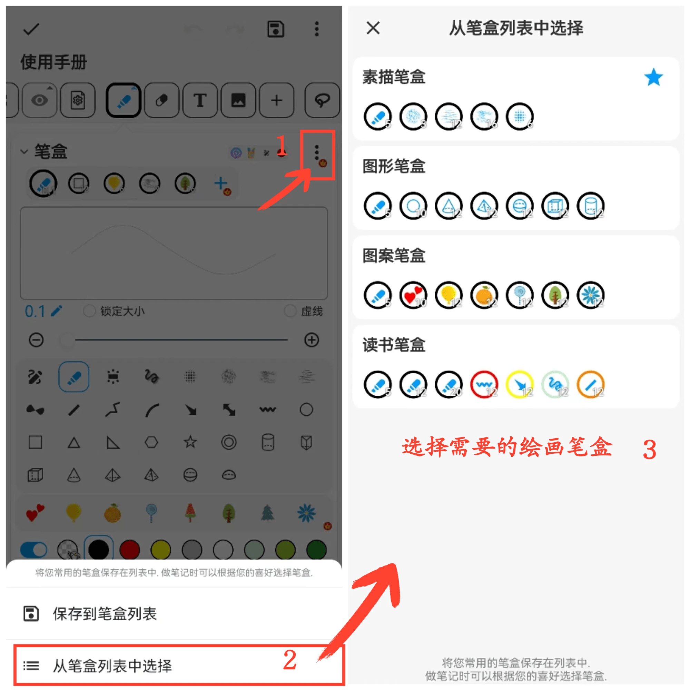

[用户手册](/drawnote/manual/zh) > [超级笔记](/drawnote/manual/zh/super_note) >

画笔功能
---

#### 操作步骤

点击工具栏中的“画笔”按钮，可进行以下操作。

#### 收藏多个画笔

点击笔盒收藏栏中的“+”按钮，可添加不同类型的画笔。

#### 调整画笔大小

使用中间的滑动条或两边的“+”和“-”按钮，以调整笔画的大小。

#### 锁定画笔大小

勾选“锁定大小”按钮，可使画笔大小固定。即使对画布或页面进行缩放，画笔大小也不会随之改变。

#### 虚线效果

勾选“虚线”按钮即可应用虚线画笔效果。

#### 调整画笔位置
在笔盒栏中，长按需要调整位置的画笔，然后左右拖动至适当位置，释放即可完成调整。

#### 删除收藏的画笔

在笔盒栏中，长按需要删除的画笔，然后向右拖动至“回收桶”图标上释放，即可删除该画笔。

#### 保存常用笔盒
在笔盒页面，点击右上角的“⋮”按钮，选择“保存到笔盒列表”。接着，为笔盒命名并确认，便可保存您的常用笔盒。

#### 选择常用笔盒
在笔盒页面，点击右上角的“⋮”按钮，然后从笔盒列表中选择您需要的笔盒。

