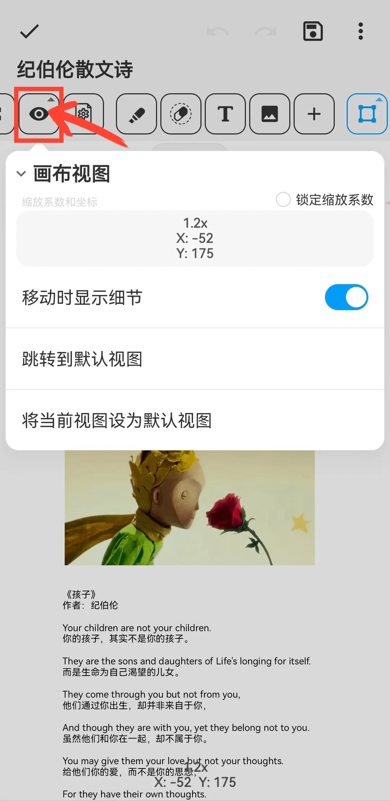

[用户手册](/drawnote/manual/zh) > [超级笔记](/drawnote/manual/zh/super_note) >

画布视图
---
画布视图是查看和编辑笔记的界面，包含坐标和缩放信息。

- 为了便于浏览大页面或内容丰富的页面，您可以设置默认视图。

- 点击“跳转到默认视图”按钮，即可迅速回到您设定的默认视图位置。

#### 锁定缩放系数
勾选“锁定缩放系数”后，画布将保持当前缩放级别，禁止手势缩放。