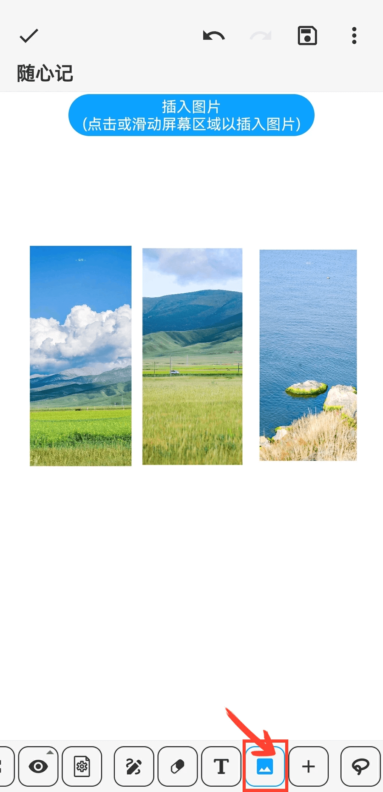
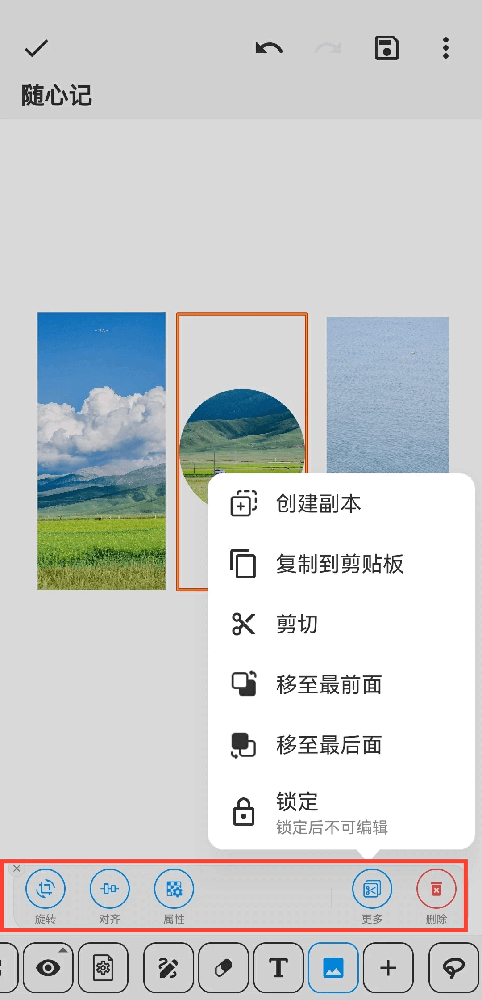

[用户手册](/drawnote/manual/zh) > [超级笔记](/drawnote/manual/zh/super_note) >

插入图片
---
#### 操作步骤

1.在工具栏中点击“图片”按钮

2.通过点击或滑动屏幕区域，即可在相应位置插入图片。

#### 提示
- 选择图片后，底部工具栏提供编辑选项，如旋转、形状和透明度。
- 您可结合文字功能，标注图片内容，以实现更详细和准确的表达。 
- 点击图片可缩放大小。

- 