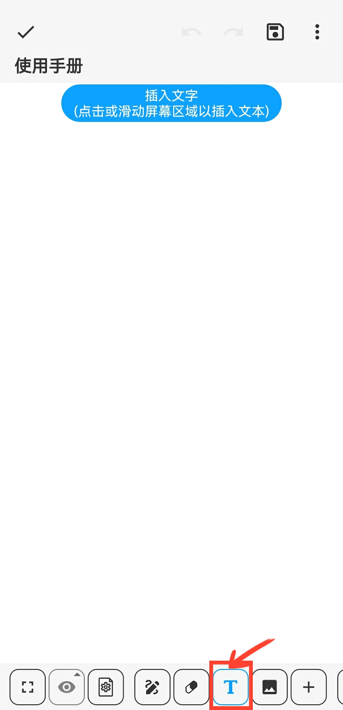
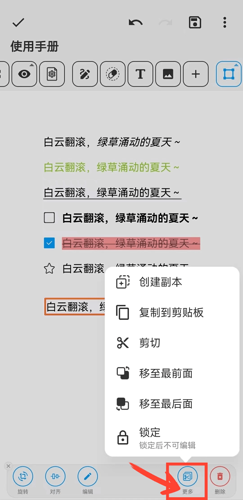
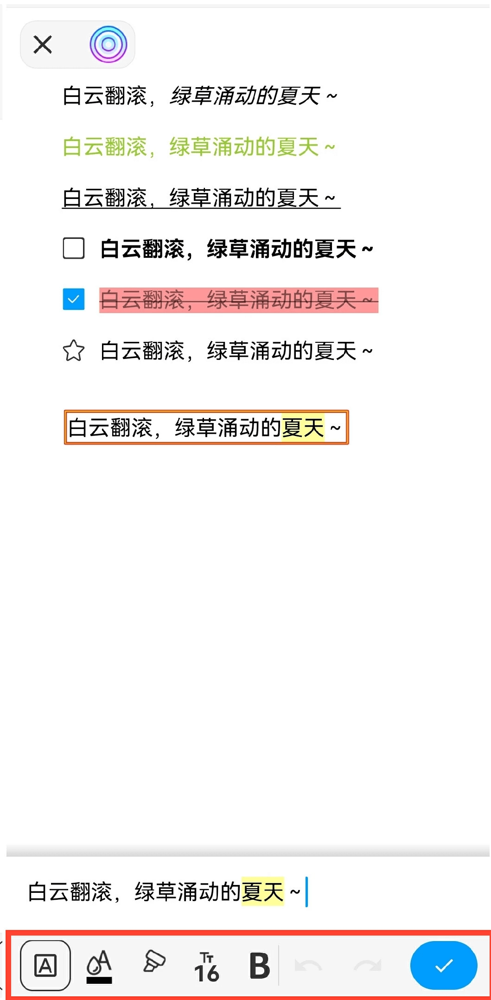

[用户手册](/drawnote/manual/zh) > [超级笔记](/drawnote/manual/zh/super_note) >

插入文字
---
#### 操作步骤

1.在工具栏中点击“T”按钮

2.点击或滑动屏幕区域，即可在相应位置插入文本内容。

#### 提示
- 选中文本框后，可对其进行旋转、对齐、编辑等操作，点击“更多”还可进行副本创建、复制、剪切和锁定等操作。

  

- 在文本编辑框中，选中文字后，可设置格式，包括颜色、大小、加粗、下划线等。

