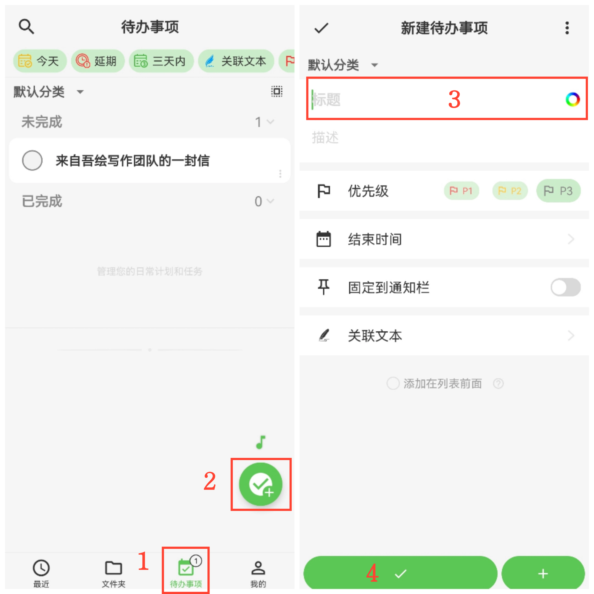
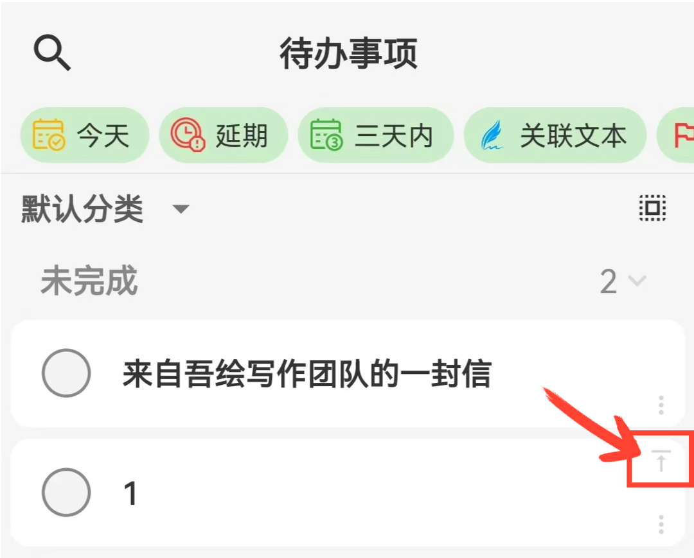

[用户手册](/yeswriter/manual/zh) > [待办事项](/yeswriter/manual/zh/to_do) >

新建待办事项
---
#### 操作步骤

1.进入「待办事项」页面；

2.点击右下角「+」按钮；

3.填写标题、描述等信息；

4.点击「确认」，完成创建。

#### 提示

1.连续添加：在“新建待办事项页面”点击左下角“+”，无需退出即可继续添加。

2.事项计数：底部标签栏显示当前待完成事项数量。

3.置顶事项：在列表中点击事项右上角「置顶」，将其移动至顶部。

